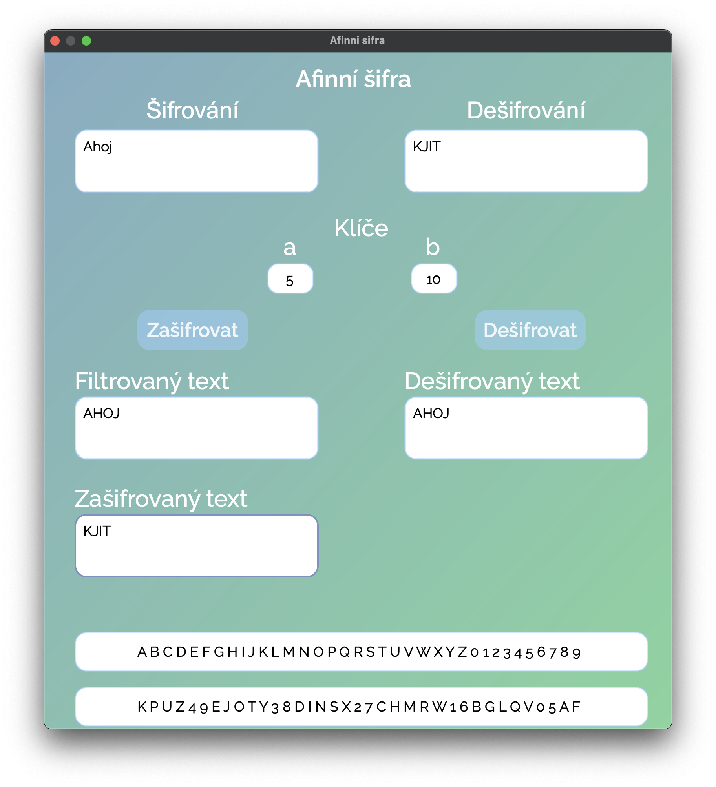

# AffineCypher

AffineCypher is a Python application that implements the Affine cipher encryption and decryption algorithm. It includes a graphical user interface (GUI) built with PyQt6.

## 🎮 Features

- Encrypts and decrypts text using the Affine cipher.
- Handles Czech and English character encodings.
- Provides a user-friendly GUI for easy interaction.
- Displays filtered text and modified alphabets for better understanding.

## 🧠 GUI Overview

- **Zadejte text k šifrování**: Enter the text to be encrypted.
- **Klíče (a, b)**: Enter the keys for encryption.
- **Zašifrovat**: Button to encrypt the text.
- **Filtrovaný text**: Displays the filtered text after preprocessing.
- **Zašifrovaný text**: Displays the encrypted text.
- **Zadejte text k dešifrování**: Enter the text to be decrypted.
- **Dešifrovat**: Button to decrypt the text.
- **Dešifrovaný text**: Displays the decrypted text.
- **Abeceda**: Displays the original and modified alphabets.

## 📊 Example

### Encryption

1. Enter the text to be encrypted in the **Zadejte text k šifrování** field.
2. Enter the keys `a` and `b` in the **Klíče (a, b)** fields.
3. Click the **Zašifrovat** button.
4. The filtered text will be displayed in the **Filtrovaný text** field.
5. The encrypted text will be displayed in the **Zašifrovaný text** field.
6. The modified alphabet will be displayed in the **Abeceda** fields.

### Decryption

1. Enter the text to be decrypted in the **Zadejte text k dešifrování** field.
2. Enter the keys `a` and `b` in the **Klíče (a, b)** fields.
3. Click the **Dešifrovat** button.
4. The decrypted text will be displayed in the **Dešifrovaný text** field.

---

#### Author: Filip Hajduch
###### and GitHub Copilot